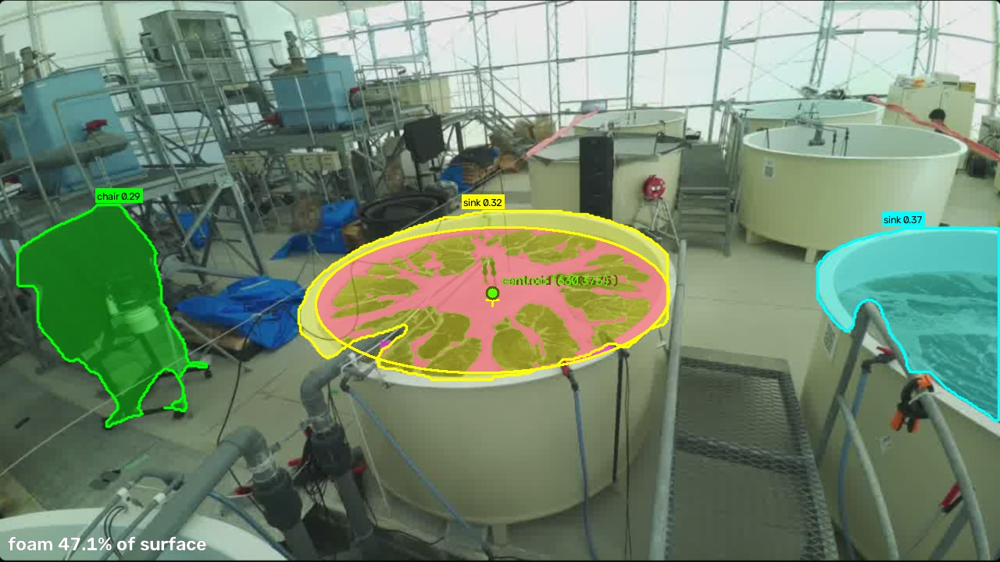

# picam-foam-segmentation

PiCam (Raspberry Pi カメラ) の MJPEG ライブストリームに対して、水槽水面の **白い泡** をリアルタイムに抽出し、
泡の割合と重心を可視化・記録するツール。セマンティック/インスタンスセグメンテーションと同時実行できる。



## 機能

| モード | 内容 |
|---|---|
| `foam` | 水面 ROI (楕円) 内で「明るく低彩度」な画素を泡として抽出。水面に占める泡の割合・泡の重心・重心の軌跡を表示 ([foam.py](foam.py)) |
| `semantic` | SegFormer (ADE20K 150 クラス) によるセマンティックセグメンテーション |
| `instance` | YOLO11-seg (COCO 80 クラス) によるインスタンスセグメンテーション (マスクを輪郭付きで描画) |

`--mode foam,instance` のようにカンマ区切りで組み合わせて同時に実行できる (`both` = `semantic,instance`)。

## セットアップ

```bash
python3 -m venv .venv
.venv/bin/pip install -r requirements.txt
```

Apple Silicon では MPS (GPU) を自動で使用する。YOLO / SegFormer の重みは初回実行時に自動ダウンロードされる。

## 使い方

ストリームは HTTP Basic 認証。URL と認証情報は環境変数で渡す (コードやファイルには書かない)。

```bash
export PICAM_URL=https://<camera-host>/stream
read "PICAM_USER?PiCam user: " && read -s "PICAM_PASS?PiCam password: " && echo && export PICAM_USER PICAM_PASS
.venv/bin/python stream_segmentation.py --mode foam --csv foam_log.csv --save foam_live.mp4
```

主なオプション:

| オプション | 説明 |
|---|---|
| `--mode` | `semantic` / `instance` / `foam` をカンマ区切りで指定 |
| `--url` | ストリーム URL (未指定時は環境変数 `PICAM_URL`) |
| `--csv` | 泡の割合・重心を時系列 CSV に追記 (`--csv-interval` 秒ごと、既定 1 秒) |
| `--save` | 結果を mp4 に保存 (`--save-fps` で実時間に合わせて記録、既定 15 fps) |
| `--yolo-classes` | YOLO の検出クラスを限定 (例: `person`) |
| `--roi` / `--calibrate` / `--reset-roi` | 泡モードの水面 ROI の保存先 / クリックで手動設定 / 自動推定し直し |
| `--image` | ストリームの代わりにローカル画像を処理 |
| `--no-window` | ウィンドウを出さずに実行 |

表示ウィンドウのキー操作: `q` 終了、`s` スナップショットを `snapshots/` に保存。

### CSV の列

| 列 | 意味 |
|---|---|
| `foam_ratio` | 水面 ROI に占める泡の面積割合 |
| `cx`, `cy` | 泡の重心 (画像ピクセル座標) |
| `dx`, `dy` | ROI 中心からのずれ。楕円の半幅/半高で正規化 (-1〜1、右・下が正) |

## 泡抽出の手順

1. 水面 ROI: カメラ固定前提で楕円を [foam_roi.json](foam_roi.json) に保存して再利用 (現在の画角では内縁 10 点から手動フィット)。
   未設定時は SegFormer の `tank` 領域内の沈殿物ブロブの凸包から自動推定する (外壁の影を拾うなど不安定なので `--calibrate` 推奨)。
2. ROI 内で Lab の L が Otsu 閾値より明るく、HSV 彩度 < 60 の画素を泡とし、モルフォロジー処理で整形。
3. 泡マスクの面積割合と重心 (モーメント) を算出。

## 既知の制限

- 泡がほぼ無いフレームでも Otsu が水面を二分するため、泡の割合を過大評価する。
- 沈殿物上の細い泡の筋は取りこぼしやすい。ROI の縁で水槽内壁を一部含む可能性がある。
- 重心は画像座標 (斜め視点) のまま。実平面上の位置にするには楕円→円の射影補正が必要。
- YOLO (COCO) には「水槽」クラスが無く、水槽を `sink` 等と誤分類する。

## ファイル構成

- [stream_segmentation.py](stream_segmentation.py) — ストリーム受信・各モデル・メインループ
- [foam.py](foam.py) — 泡セグメンテーション (ROI 推定、抽出、重心、描画)
- `foam_roi.json` — 現在の画角用の水面 ROI
- `samples/` — テスト画像と結果、`snapshots/` — ライブ中のスナップショット
- `foam_log*.csv` — 2026-10-09 のライブ計測ログ
